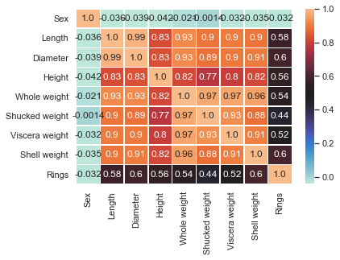
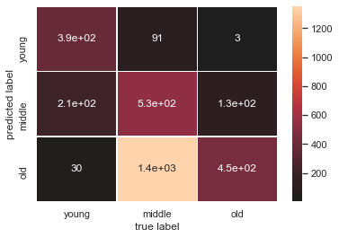
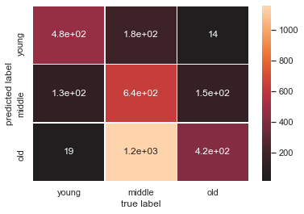

```python
import pandas as pd
import numpy as np
import matplotlib.pyplot as plt
#columns = ['Sex', 'Length', 'Diameter', 'Height', 'Whole weight', 'Shucked weight', 'Viscera weight', 'Shell weight','Rings']
mydata = pd.read_csv('abalone_dataset.csv',sep="\t")
df = mydata.iloc[:, :]
df.columns = ['Sex', 'Length', 'Diameter', 'Height', 'Whole weight', 'Shucked weight', 'Viscera weight', 'Shell weight','Rings']
```


```python
# Import label encoder 
from sklearn import preprocessing
# label_encoder object knows how to understand word labels. 
label_encoder = preprocessing.LabelEncoder()
# Encode labels in column 'Country'. 
df["Sex"]= label_encoder.fit_transform(df["Sex"]) 
df.head()
```


<div>
<style scoped>
    .dataframe tbody tr th:only-of-type {
        vertical-align: middle;
    }

    .dataframe tbody tr th {
        vertical-align: top;
    }

    .dataframe thead th {
        text-align: right;
    }
</style>
<table border="1" class="dataframe">
  <thead>
    <tr style="text-align: right;">
      <th></th>
      <th>Sex</th>
      <th>Length</th>
      <th>Diameter</th>
      <th>Height</th>
      <th>Whole weight</th>
      <th>Shucked weight</th>
      <th>Viscera weight</th>
      <th>Shell weight</th>
      <th>Rings</th>
    </tr>
  </thead>
  <tbody>
    <tr>
      <th>0</th>
      <td>2</td>
      <td>0.455</td>
      <td>0.365</td>
      <td>0.095</td>
      <td>0.5140</td>
      <td>0.2245</td>
      <td>0.1010</td>
      <td>0.150</td>
      <td>3</td>
    </tr>
    <tr>
      <th>1</th>
      <td>2</td>
      <td>0.350</td>
      <td>0.265</td>
      <td>0.090</td>
      <td>0.2255</td>
      <td>0.0995</td>
      <td>0.0485</td>
      <td>0.070</td>
      <td>1</td>
    </tr>
    <tr>
      <th>2</th>
      <td>0</td>
      <td>0.530</td>
      <td>0.420</td>
      <td>0.135</td>
      <td>0.6770</td>
      <td>0.2565</td>
      <td>0.1415</td>
      <td>0.210</td>
      <td>2</td>
    </tr>
    <tr>
      <th>3</th>
      <td>2</td>
      <td>0.440</td>
      <td>0.365</td>
      <td>0.125</td>
      <td>0.5160</td>
      <td>0.2155</td>
      <td>0.1140</td>
      <td>0.155</td>
      <td>2</td>
    </tr>
    <tr>
      <th>4</th>
      <td>1</td>
      <td>0.330</td>
      <td>0.255</td>
      <td>0.080</td>
      <td>0.2050</td>
      <td>0.0895</td>
      <td>0.0395</td>
      <td>0.055</td>
      <td>1</td>
    </tr>
  </tbody>
</table>
</div>


```python
df.describe()
```


<div>
<style scoped>
    .dataframe tbody tr th:only-of-type {
        vertical-align: middle;
    }

    .dataframe tbody tr th {
        vertical-align: top;
    }

    .dataframe thead th {
        text-align: right;
    }
</style>
<table border="1" class="dataframe">
  <thead>
    <tr style="text-align: right;">
      <th></th>
      <th>Sex</th>
      <th>Length</th>
      <th>Diameter</th>
      <th>Height</th>
      <th>Whole weight</th>
      <th>Shucked weight</th>
      <th>Viscera weight</th>
      <th>Shell weight</th>
      <th>Rings</th>
    </tr>
  </thead>
  <tbody>
    <tr>
      <th>count</th>
      <td>4177.000000</td>
      <td>4177.000000</td>
      <td>4177.000000</td>
      <td>4177.000000</td>
      <td>4177.000000</td>
      <td>4177.000000</td>
      <td>4177.000000</td>
      <td>4177.000000</td>
      <td>4177.000000</td>
    </tr>
    <tr>
      <th>mean</th>
      <td>1.052909</td>
      <td>0.523992</td>
      <td>0.407881</td>
      <td>0.139516</td>
      <td>0.828742</td>
      <td>0.359367</td>
      <td>0.180594</td>
      <td>0.238831</td>
      <td>2.028968</td>
    </tr>
    <tr>
      <th>std</th>
      <td>0.822240</td>
      <td>0.120093</td>
      <td>0.099240</td>
      <td>0.041827</td>
      <td>0.490389</td>
      <td>0.221963</td>
      <td>0.109614</td>
      <td>0.139203</td>
      <td>0.655710</td>
    </tr>
    <tr>
      <th>min</th>
      <td>0.000000</td>
      <td>0.075000</td>
      <td>0.055000</td>
      <td>0.000000</td>
      <td>0.002000</td>
      <td>0.001000</td>
      <td>0.000500</td>
      <td>0.001500</td>
      <td>1.000000</td>
    </tr>
    <tr>
      <th>25%</th>
      <td>0.000000</td>
      <td>0.450000</td>
      <td>0.350000</td>
      <td>0.115000</td>
      <td>0.441500</td>
      <td>0.186000</td>
      <td>0.093500</td>
      <td>0.130000</td>
      <td>2.000000</td>
    </tr>
    <tr>
      <th>50%</th>
      <td>1.000000</td>
      <td>0.545000</td>
      <td>0.425000</td>
      <td>0.140000</td>
      <td>0.799500</td>
      <td>0.336000</td>
      <td>0.171000</td>
      <td>0.234000</td>
      <td>2.000000</td>
    </tr>
    <tr>
      <th>75%</th>
      <td>2.000000</td>
      <td>0.615000</td>
      <td>0.480000</td>
      <td>0.165000</td>
      <td>1.153000</td>
      <td>0.502000</td>
      <td>0.253000</td>
      <td>0.329000</td>
      <td>2.000000</td>
    </tr>
    <tr>
      <th>max</th>
      <td>2.000000</td>
      <td>0.815000</td>
      <td>0.650000</td>
      <td>1.130000</td>
      <td>2.825500</td>
      <td>1.488000</td>
      <td>0.760000</td>
      <td>1.005000</td>
      <td>3.000000</td>
    </tr>
  </tbody>
</table>
</div>


```python
import pandas as pd
import numpy as np
corr = df.corr()
corr.style.background_gradient(cmap='coolwarm')
```


<style  type="text/css" >
    #T_8b1e6394_ac6c_11ea_9f53_c0b6f95b3942row0_col0 {
            background-color:  #b40426;
            color:  #f1f1f1;
        }    #T_8b1e6394_ac6c_11ea_9f53_c0b6f95b3942row0_col1 {
            background-color:  #3b4cc0;
            color:  #f1f1f1;
        }    #T_8b1e6394_ac6c_11ea_9f53_c0b6f95b3942row0_col2 {
            background-color:  #3b4cc0;
            color:  #f1f1f1;
        }    #T_8b1e6394_ac6c_11ea_9f53_c0b6f95b3942row0_col3 {
            background-color:  #3b4cc0;
            color:  #f1f1f1;
        }    #T_8b1e6394_ac6c_11ea_9f53_c0b6f95b3942row0_col4 {
            background-color:  #3b4cc0;
            color:  #f1f1f1;
        }    #T_8b1e6394_ac6c_11ea_9f53_c0b6f95b3942row0_col5 {
            background-color:  #3b4cc0;
            color:  #f1f1f1;
        }    #T_8b1e6394_ac6c_11ea_9f53_c0b6f95b3942row0_col6 {
            background-color:  #3b4cc0;
            color:  #f1f1f1;
        }    #T_8b1e6394_ac6c_11ea_9f53_c0b6f95b3942row0_col7 {
            background-color:  #3b4cc0;
            color:  #f1f1f1;
        }    #T_8b1e6394_ac6c_11ea_9f53_c0b6f95b3942row0_col8 {
            background-color:  #3b4cc0;
            color:  #f1f1f1;
        }    #T_8b1e6394_ac6c_11ea_9f53_c0b6f95b3942row1_col0 {
            background-color:  #3c4ec2;
            color:  #f1f1f1;
        }    #T_8b1e6394_ac6c_11ea_9f53_c0b6f95b3942row1_col1 {
            background-color:  #b40426;
            color:  #f1f1f1;
        }    #T_8b1e6394_ac6c_11ea_9f53_c0b6f95b3942row1_col2 {
            background-color:  #b8122a;
            color:  #f1f1f1;
        }    #T_8b1e6394_ac6c_11ea_9f53_c0b6f95b3942row1_col3 {
            background-color:  #e7745b;
            color:  #000000;
        }    #T_8b1e6394_ac6c_11ea_9f53_c0b6f95b3942row1_col4 {
            background-color:  #cd423b;
            color:  #f1f1f1;
        }    #T_8b1e6394_ac6c_11ea_9f53_c0b6f95b3942row1_col5 {
            background-color:  #d75445;
            color:  #000000;
        }    #T_8b1e6394_ac6c_11ea_9f53_c0b6f95b3942row1_col6 {
            background-color:  #d55042;
            color:  #000000;
        }    #T_8b1e6394_ac6c_11ea_9f53_c0b6f95b3942row1_col7 {
            background-color:  #d65244;
            color:  #000000;
        }    #T_8b1e6394_ac6c_11ea_9f53_c0b6f95b3942row1_col8 {
            background-color:  #f1cdba;
            color:  #000000;
        }    #T_8b1e6394_ac6c_11ea_9f53_c0b6f95b3942row2_col0 {
            background-color:  #3b4cc0;
            color:  #f1f1f1;
        }    #T_8b1e6394_ac6c_11ea_9f53_c0b6f95b3942row2_col1 {
            background-color:  #b8122a;
            color:  #f1f1f1;
        }    #T_8b1e6394_ac6c_11ea_9f53_c0b6f95b3942row2_col2 {
            background-color:  #b40426;
            color:  #f1f1f1;
        }    #T_8b1e6394_ac6c_11ea_9f53_c0b6f95b3942row2_col3 {
            background-color:  #e57058;
            color:  #000000;
        }    #T_8b1e6394_ac6c_11ea_9f53_c0b6f95b3942row2_col4 {
            background-color:  #cd423b;
            color:  #f1f1f1;
        }    #T_8b1e6394_ac6c_11ea_9f53_c0b6f95b3942row2_col5 {
            background-color:  #d85646;
            color:  #000000;
        }    #T_8b1e6394_ac6c_11ea_9f53_c0b6f95b3942row2_col6 {
            background-color:  #d55042;
            color:  #000000;
        }    #T_8b1e6394_ac6c_11ea_9f53_c0b6f95b3942row2_col7 {
            background-color:  #d44e41;
            color:  #000000;
        }    #T_8b1e6394_ac6c_11ea_9f53_c0b6f95b3942row2_col8 {
            background-color:  #f2c9b4;
            color:  #000000;
        }    #T_8b1e6394_ac6c_11ea_9f53_c0b6f95b3942row3_col0 {
            background-color:  #3b4cc0;
            color:  #f1f1f1;
        }    #T_8b1e6394_ac6c_11ea_9f53_c0b6f95b3942row3_col1 {
            background-color:  #e7745b;
            color:  #000000;
        }    #T_8b1e6394_ac6c_11ea_9f53_c0b6f95b3942row3_col2 {
            background-color:  #e57058;
            color:  #000000;
        }    #T_8b1e6394_ac6c_11ea_9f53_c0b6f95b3942row3_col3 {
            background-color:  #b40426;
            color:  #f1f1f1;
        }    #T_8b1e6394_ac6c_11ea_9f53_c0b6f95b3942row3_col4 {
            background-color:  #e97a5f;
            color:  #000000;
        }    #T_8b1e6394_ac6c_11ea_9f53_c0b6f95b3942row3_col5 {
            background-color:  #f18f71;
            color:  #000000;
        }    #T_8b1e6394_ac6c_11ea_9f53_c0b6f95b3942row3_col6 {
            background-color:  #ed8366;
            color:  #000000;
        }    #T_8b1e6394_ac6c_11ea_9f53_c0b6f95b3942row3_col7 {
            background-color:  #e97a5f;
            color:  #000000;
        }    #T_8b1e6394_ac6c_11ea_9f53_c0b6f95b3942row3_col8 {
            background-color:  #eed0c0;
            color:  #000000;
        }    #T_8b1e6394_ac6c_11ea_9f53_c0b6f95b3942row4_col0 {
            background-color:  #4055c8;
            color:  #f1f1f1;
        }    #T_8b1e6394_ac6c_11ea_9f53_c0b6f95b3942row4_col1 {
            background-color:  #cd423b;
            color:  #f1f1f1;
        }    #T_8b1e6394_ac6c_11ea_9f53_c0b6f95b3942row4_col2 {
            background-color:  #cd423b;
            color:  #f1f1f1;
        }    #T_8b1e6394_ac6c_11ea_9f53_c0b6f95b3942row4_col3 {
            background-color:  #e9785d;
            color:  #000000;
        }    #T_8b1e6394_ac6c_11ea_9f53_c0b6f95b3942row4_col4 {
            background-color:  #b40426;
            color:  #f1f1f1;
        }    #T_8b1e6394_ac6c_11ea_9f53_c0b6f95b3942row4_col5 {
            background-color:  #be242e;
            color:  #f1f1f1;
        }    #T_8b1e6394_ac6c_11ea_9f53_c0b6f95b3942row4_col6 {
            background-color:  #c0282f;
            color:  #f1f1f1;
        }    #T_8b1e6394_ac6c_11ea_9f53_c0b6f95b3942row4_col7 {
            background-color:  #c43032;
            color:  #f1f1f1;
        }    #T_8b1e6394_ac6c_11ea_9f53_c0b6f95b3942row4_col8 {
            background-color:  #ead4c8;
            color:  #000000;
        }    #T_8b1e6394_ac6c_11ea_9f53_c0b6f95b3942row5_col0 {
            background-color:  #455cce;
            color:  #f1f1f1;
        }    #T_8b1e6394_ac6c_11ea_9f53_c0b6f95b3942row5_col1 {
            background-color:  #d65244;
            color:  #000000;
        }    #T_8b1e6394_ac6c_11ea_9f53_c0b6f95b3942row5_col2 {
            background-color:  #d75445;
            color:  #000000;
        }    #T_8b1e6394_ac6c_11ea_9f53_c0b6f95b3942row5_col3 {
            background-color:  #f08b6e;
            color:  #000000;
        }    #T_8b1e6394_ac6c_11ea_9f53_c0b6f95b3942row5_col4 {
            background-color:  #be242e;
            color:  #f1f1f1;
        }    #T_8b1e6394_ac6c_11ea_9f53_c0b6f95b3942row5_col5 {
            background-color:  #b40426;
            color:  #f1f1f1;
        }    #T_8b1e6394_ac6c_11ea_9f53_c0b6f95b3942row5_col6 {
            background-color:  #cb3e38;
            color:  #f1f1f1;
        }    #T_8b1e6394_ac6c_11ea_9f53_c0b6f95b3942row5_col7 {
            background-color:  #da5a49;
            color:  #000000;
        }    #T_8b1e6394_ac6c_11ea_9f53_c0b6f95b3942row5_col8 {
            background-color:  #d3dbe7;
            color:  #000000;
        }    #T_8b1e6394_ac6c_11ea_9f53_c0b6f95b3942row6_col0 {
            background-color:  #3d50c3;
            color:  #f1f1f1;
        }    #T_8b1e6394_ac6c_11ea_9f53_c0b6f95b3942row6_col1 {
            background-color:  #d44e41;
            color:  #000000;
        }    #T_8b1e6394_ac6c_11ea_9f53_c0b6f95b3942row6_col2 {
            background-color:  #d55042;
            color:  #000000;
        }    #T_8b1e6394_ac6c_11ea_9f53_c0b6f95b3942row6_col3 {
            background-color:  #ec8165;
            color:  #000000;
        }    #T_8b1e6394_ac6c_11ea_9f53_c0b6f95b3942row6_col4 {
            background-color:  #c0282f;
            color:  #f1f1f1;
        }    #T_8b1e6394_ac6c_11ea_9f53_c0b6f95b3942row6_col5 {
            background-color:  #cc403a;
            color:  #f1f1f1;
        }    #T_8b1e6394_ac6c_11ea_9f53_c0b6f95b3942row6_col6 {
            background-color:  #b40426;
            color:  #f1f1f1;
        }    #T_8b1e6394_ac6c_11ea_9f53_c0b6f95b3942row6_col7 {
            background-color:  #d24b40;
            color:  #f1f1f1;
        }    #T_8b1e6394_ac6c_11ea_9f53_c0b6f95b3942row6_col8 {
            background-color:  #e4d9d2;
            color:  #000000;
        }    #T_8b1e6394_ac6c_11ea_9f53_c0b6f95b3942row7_col0 {
            background-color:  #3c4ec2;
            color:  #f1f1f1;
        }    #T_8b1e6394_ac6c_11ea_9f53_c0b6f95b3942row7_col1 {
            background-color:  #d65244;
            color:  #000000;
        }    #T_8b1e6394_ac6c_11ea_9f53_c0b6f95b3942row7_col2 {
            background-color:  #d44e41;
            color:  #000000;
        }    #T_8b1e6394_ac6c_11ea_9f53_c0b6f95b3942row7_col3 {
            background-color:  #e9785d;
            color:  #000000;
        }    #T_8b1e6394_ac6c_11ea_9f53_c0b6f95b3942row7_col4 {
            background-color:  #c43032;
            color:  #f1f1f1;
        }    #T_8b1e6394_ac6c_11ea_9f53_c0b6f95b3942row7_col5 {
            background-color:  #dc5d4a;
            color:  #000000;
        }    #T_8b1e6394_ac6c_11ea_9f53_c0b6f95b3942row7_col6 {
            background-color:  #d24b40;
            color:  #f1f1f1;
        }    #T_8b1e6394_ac6c_11ea_9f53_c0b6f95b3942row7_col7 {
            background-color:  #b40426;
            color:  #f1f1f1;
        }    #T_8b1e6394_ac6c_11ea_9f53_c0b6f95b3942row7_col8 {
            background-color:  #f3c7b1;
            color:  #000000;
        }    #T_8b1e6394_ac6c_11ea_9f53_c0b6f95b3942row8_col0 {
            background-color:  #3d50c3;
            color:  #f1f1f1;
        }    #T_8b1e6394_ac6c_11ea_9f53_c0b6f95b3942row8_col1 {
            background-color:  #f1ccb8;
            color:  #000000;
        }    #T_8b1e6394_ac6c_11ea_9f53_c0b6f95b3942row8_col2 {
            background-color:  #f3c8b2;
            color:  #000000;
        }    #T_8b1e6394_ac6c_11ea_9f53_c0b6f95b3942row8_col3 {
            background-color:  #efcfbf;
            color:  #000000;
        }    #T_8b1e6394_ac6c_11ea_9f53_c0b6f95b3942row8_col4 {
            background-color:  #e9d5cb;
            color:  #000000;
        }    #T_8b1e6394_ac6c_11ea_9f53_c0b6f95b3942row8_col5 {
            background-color:  #cedaeb;
            color:  #000000;
        }    #T_8b1e6394_ac6c_11ea_9f53_c0b6f95b3942row8_col6 {
            background-color:  #e4d9d2;
            color:  #000000;
        }    #T_8b1e6394_ac6c_11ea_9f53_c0b6f95b3942row8_col7 {
            background-color:  #f4c6af;
            color:  #000000;
        }    #T_8b1e6394_ac6c_11ea_9f53_c0b6f95b3942row8_col8 {
            background-color:  #b40426;
            color:  #f1f1f1;
        }</style><table id="T_8b1e6394_ac6c_11ea_9f53_c0b6f95b3942" ><thead>    <tr>        <th class="blank level0" ></th>        <th class="col_heading level0 col0" >Sex</th>        <th class="col_heading level0 col1" >Length</th>        <th class="col_heading level0 col2" >Diameter</th>        <th class="col_heading level0 col3" >Height</th>        <th class="col_heading level0 col4" >Whole weight</th>        <th class="col_heading level0 col5" >Shucked weight</th>        <th class="col_heading level0 col6" >Viscera weight</th>        <th class="col_heading level0 col7" >Shell weight</th>        <th class="col_heading level0 col8" >Rings</th>    </tr></thead><tbody>
                <tr>
                        <th id="T_8b1e6394_ac6c_11ea_9f53_c0b6f95b3942level0_row0" class="row_heading level0 row0" >Sex</th>
                        <td id="T_8b1e6394_ac6c_11ea_9f53_c0b6f95b3942row0_col0" class="data row0 col0" >1.000000</td>
                        <td id="T_8b1e6394_ac6c_11ea_9f53_c0b6f95b3942row0_col1" class="data row0 col1" >-0.036066</td>
                        <td id="T_8b1e6394_ac6c_11ea_9f53_c0b6f95b3942row0_col2" class="data row0 col2" >-0.038874</td>
                        <td id="T_8b1e6394_ac6c_11ea_9f53_c0b6f95b3942row0_col3" class="data row0 col3" >-0.042077</td>
                        <td id="T_8b1e6394_ac6c_11ea_9f53_c0b6f95b3942row0_col4" class="data row0 col4" >-0.021391</td>
                        <td id="T_8b1e6394_ac6c_11ea_9f53_c0b6f95b3942row0_col5" class="data row0 col5" >-0.001373</td>
                        <td id="T_8b1e6394_ac6c_11ea_9f53_c0b6f95b3942row0_col6" class="data row0 col6" >-0.032067</td>
                        <td id="T_8b1e6394_ac6c_11ea_9f53_c0b6f95b3942row0_col7" class="data row0 col7" >-0.034854</td>
                        <td id="T_8b1e6394_ac6c_11ea_9f53_c0b6f95b3942row0_col8" class="data row0 col8" >-0.032157</td>
            </tr>
            <tr>
                        <th id="T_8b1e6394_ac6c_11ea_9f53_c0b6f95b3942level0_row1" class="row_heading level0 row1" >Length</th>
                        <td id="T_8b1e6394_ac6c_11ea_9f53_c0b6f95b3942row1_col0" class="data row1 col0" >-0.036066</td>
                        <td id="T_8b1e6394_ac6c_11ea_9f53_c0b6f95b3942row1_col1" class="data row1 col1" >1.000000</td>
                        <td id="T_8b1e6394_ac6c_11ea_9f53_c0b6f95b3942row1_col2" class="data row1 col2" >0.986812</td>
                        <td id="T_8b1e6394_ac6c_11ea_9f53_c0b6f95b3942row1_col3" class="data row1 col3" >0.827554</td>
                        <td id="T_8b1e6394_ac6c_11ea_9f53_c0b6f95b3942row1_col4" class="data row1 col4" >0.925261</td>
                        <td id="T_8b1e6394_ac6c_11ea_9f53_c0b6f95b3942row1_col5" class="data row1 col5" >0.897914</td>
                        <td id="T_8b1e6394_ac6c_11ea_9f53_c0b6f95b3942row1_col6" class="data row1 col6" >0.903018</td>
                        <td id="T_8b1e6394_ac6c_11ea_9f53_c0b6f95b3942row1_col7" class="data row1 col7" >0.897706</td>
                        <td id="T_8b1e6394_ac6c_11ea_9f53_c0b6f95b3942row1_col8" class="data row1 col8" >0.580662</td>
            </tr>
            <tr>
                        <th id="T_8b1e6394_ac6c_11ea_9f53_c0b6f95b3942level0_row2" class="row_heading level0 row2" >Diameter</th>
                        <td id="T_8b1e6394_ac6c_11ea_9f53_c0b6f95b3942row2_col0" class="data row2 col0" >-0.038874</td>
                        <td id="T_8b1e6394_ac6c_11ea_9f53_c0b6f95b3942row2_col1" class="data row2 col1" >0.986812</td>
                        <td id="T_8b1e6394_ac6c_11ea_9f53_c0b6f95b3942row2_col2" class="data row2 col2" >1.000000</td>
                        <td id="T_8b1e6394_ac6c_11ea_9f53_c0b6f95b3942row2_col3" class="data row2 col3" >0.833684</td>
                        <td id="T_8b1e6394_ac6c_11ea_9f53_c0b6f95b3942row2_col4" class="data row2 col4" >0.925452</td>
                        <td id="T_8b1e6394_ac6c_11ea_9f53_c0b6f95b3942row2_col5" class="data row2 col5" >0.893162</td>
                        <td id="T_8b1e6394_ac6c_11ea_9f53_c0b6f95b3942row2_col6" class="data row2 col6" >0.899724</td>
                        <td id="T_8b1e6394_ac6c_11ea_9f53_c0b6f95b3942row2_col7" class="data row2 col7" >0.905330</td>
                        <td id="T_8b1e6394_ac6c_11ea_9f53_c0b6f95b3942row2_col8" class="data row2 col8" >0.595623</td>
            </tr>
            <tr>
                        <th id="T_8b1e6394_ac6c_11ea_9f53_c0b6f95b3942level0_row3" class="row_heading level0 row3" >Height</th>
                        <td id="T_8b1e6394_ac6c_11ea_9f53_c0b6f95b3942row3_col0" class="data row3 col0" >-0.042077</td>
                        <td id="T_8b1e6394_ac6c_11ea_9f53_c0b6f95b3942row3_col1" class="data row3 col1" >0.827554</td>
                        <td id="T_8b1e6394_ac6c_11ea_9f53_c0b6f95b3942row3_col2" class="data row3 col2" >0.833684</td>
                        <td id="T_8b1e6394_ac6c_11ea_9f53_c0b6f95b3942row3_col3" class="data row3 col3" >1.000000</td>
                        <td id="T_8b1e6394_ac6c_11ea_9f53_c0b6f95b3942row3_col4" class="data row3 col4" >0.819221</td>
                        <td id="T_8b1e6394_ac6c_11ea_9f53_c0b6f95b3942row3_col5" class="data row3 col5" >0.774972</td>
                        <td id="T_8b1e6394_ac6c_11ea_9f53_c0b6f95b3942row3_col6" class="data row3 col6" >0.798319</td>
                        <td id="T_8b1e6394_ac6c_11ea_9f53_c0b6f95b3942row3_col7" class="data row3 col7" >0.817338</td>
                        <td id="T_8b1e6394_ac6c_11ea_9f53_c0b6f95b3942row3_col8" class="data row3 col8" >0.562097</td>
            </tr>
            <tr>
                        <th id="T_8b1e6394_ac6c_11ea_9f53_c0b6f95b3942level0_row4" class="row_heading level0 row4" >Whole weight</th>
                        <td id="T_8b1e6394_ac6c_11ea_9f53_c0b6f95b3942row4_col0" class="data row4 col0" >-0.021391</td>
                        <td id="T_8b1e6394_ac6c_11ea_9f53_c0b6f95b3942row4_col1" class="data row4 col1" >0.925261</td>
                        <td id="T_8b1e6394_ac6c_11ea_9f53_c0b6f95b3942row4_col2" class="data row4 col2" >0.925452</td>
                        <td id="T_8b1e6394_ac6c_11ea_9f53_c0b6f95b3942row4_col3" class="data row4 col3" >0.819221</td>
                        <td id="T_8b1e6394_ac6c_11ea_9f53_c0b6f95b3942row4_col4" class="data row4 col4" >1.000000</td>
                        <td id="T_8b1e6394_ac6c_11ea_9f53_c0b6f95b3942row4_col5" class="data row4 col5" >0.969405</td>
                        <td id="T_8b1e6394_ac6c_11ea_9f53_c0b6f95b3942row4_col6" class="data row4 col6" >0.966375</td>
                        <td id="T_8b1e6394_ac6c_11ea_9f53_c0b6f95b3942row4_col7" class="data row4 col7" >0.955355</td>
                        <td id="T_8b1e6394_ac6c_11ea_9f53_c0b6f95b3942row4_col8" class="data row4 col8" >0.540373</td>
            </tr>
            <tr>
                        <th id="T_8b1e6394_ac6c_11ea_9f53_c0b6f95b3942level0_row5" class="row_heading level0 row5" >Shucked weight</th>
                        <td id="T_8b1e6394_ac6c_11ea_9f53_c0b6f95b3942row5_col0" class="data row5 col0" >-0.001373</td>
                        <td id="T_8b1e6394_ac6c_11ea_9f53_c0b6f95b3942row5_col1" class="data row5 col1" >0.897914</td>
                        <td id="T_8b1e6394_ac6c_11ea_9f53_c0b6f95b3942row5_col2" class="data row5 col2" >0.893162</td>
                        <td id="T_8b1e6394_ac6c_11ea_9f53_c0b6f95b3942row5_col3" class="data row5 col3" >0.774972</td>
                        <td id="T_8b1e6394_ac6c_11ea_9f53_c0b6f95b3942row5_col4" class="data row5 col4" >0.969405</td>
                        <td id="T_8b1e6394_ac6c_11ea_9f53_c0b6f95b3942row5_col5" class="data row5 col5" >1.000000</td>
                        <td id="T_8b1e6394_ac6c_11ea_9f53_c0b6f95b3942row5_col6" class="data row5 col6" >0.931961</td>
                        <td id="T_8b1e6394_ac6c_11ea_9f53_c0b6f95b3942row5_col7" class="data row5 col7" >0.882617</td>
                        <td id="T_8b1e6394_ac6c_11ea_9f53_c0b6f95b3942row5_col8" class="data row5 col8" >0.444997</td>
            </tr>
            <tr>
                        <th id="T_8b1e6394_ac6c_11ea_9f53_c0b6f95b3942level0_row6" class="row_heading level0 row6" >Viscera weight</th>
                        <td id="T_8b1e6394_ac6c_11ea_9f53_c0b6f95b3942row6_col0" class="data row6 col0" >-0.032067</td>
                        <td id="T_8b1e6394_ac6c_11ea_9f53_c0b6f95b3942row6_col1" class="data row6 col1" >0.903018</td>
                        <td id="T_8b1e6394_ac6c_11ea_9f53_c0b6f95b3942row6_col2" class="data row6 col2" >0.899724</td>
                        <td id="T_8b1e6394_ac6c_11ea_9f53_c0b6f95b3942row6_col3" class="data row6 col3" >0.798319</td>
                        <td id="T_8b1e6394_ac6c_11ea_9f53_c0b6f95b3942row6_col4" class="data row6 col4" >0.966375</td>
                        <td id="T_8b1e6394_ac6c_11ea_9f53_c0b6f95b3942row6_col5" class="data row6 col5" >0.931961</td>
                        <td id="T_8b1e6394_ac6c_11ea_9f53_c0b6f95b3942row6_col6" class="data row6 col6" >1.000000</td>
                        <td id="T_8b1e6394_ac6c_11ea_9f53_c0b6f95b3942row6_col7" class="data row6 col7" >0.907656</td>
                        <td id="T_8b1e6394_ac6c_11ea_9f53_c0b6f95b3942row6_col8" class="data row6 col8" >0.515325</td>
            </tr>
            <tr>
                        <th id="T_8b1e6394_ac6c_11ea_9f53_c0b6f95b3942level0_row7" class="row_heading level0 row7" >Shell weight</th>
                        <td id="T_8b1e6394_ac6c_11ea_9f53_c0b6f95b3942row7_col0" class="data row7 col0" >-0.034854</td>
                        <td id="T_8b1e6394_ac6c_11ea_9f53_c0b6f95b3942row7_col1" class="data row7 col1" >0.897706</td>
                        <td id="T_8b1e6394_ac6c_11ea_9f53_c0b6f95b3942row7_col2" class="data row7 col2" >0.905330</td>
                        <td id="T_8b1e6394_ac6c_11ea_9f53_c0b6f95b3942row7_col3" class="data row7 col3" >0.817338</td>
                        <td id="T_8b1e6394_ac6c_11ea_9f53_c0b6f95b3942row7_col4" class="data row7 col4" >0.955355</td>
                        <td id="T_8b1e6394_ac6c_11ea_9f53_c0b6f95b3942row7_col5" class="data row7 col5" >0.882617</td>
                        <td id="T_8b1e6394_ac6c_11ea_9f53_c0b6f95b3942row7_col6" class="data row7 col6" >0.907656</td>
                        <td id="T_8b1e6394_ac6c_11ea_9f53_c0b6f95b3942row7_col7" class="data row7 col7" >1.000000</td>
                        <td id="T_8b1e6394_ac6c_11ea_9f53_c0b6f95b3942row7_col8" class="data row7 col8" >0.604474</td>
            </tr>
            <tr>
                        <th id="T_8b1e6394_ac6c_11ea_9f53_c0b6f95b3942level0_row8" class="row_heading level0 row8" >Rings</th>
                        <td id="T_8b1e6394_ac6c_11ea_9f53_c0b6f95b3942row8_col0" class="data row8 col0" >-0.032157</td>
                        <td id="T_8b1e6394_ac6c_11ea_9f53_c0b6f95b3942row8_col1" class="data row8 col1" >0.580662</td>
                        <td id="T_8b1e6394_ac6c_11ea_9f53_c0b6f95b3942row8_col2" class="data row8 col2" >0.595623</td>
                        <td id="T_8b1e6394_ac6c_11ea_9f53_c0b6f95b3942row8_col3" class="data row8 col3" >0.562097</td>
                        <td id="T_8b1e6394_ac6c_11ea_9f53_c0b6f95b3942row8_col4" class="data row8 col4" >0.540373</td>
                        <td id="T_8b1e6394_ac6c_11ea_9f53_c0b6f95b3942row8_col5" class="data row8 col5" >0.444997</td>
                        <td id="T_8b1e6394_ac6c_11ea_9f53_c0b6f95b3942row8_col6" class="data row8 col6" >0.515325</td>
                        <td id="T_8b1e6394_ac6c_11ea_9f53_c0b6f95b3942row8_col7" class="data row8 col7" >0.604474</td>
                        <td id="T_8b1e6394_ac6c_11ea_9f53_c0b6f95b3942row8_col8" class="data row8 col8" >1.000000</td>
            </tr>
    </tbody></table>


```python

```


```python
import numpy as np
import seaborn as sns
sns.set()
ax = sns.heatmap(corr, center=0.5, annot=True, linewidths=.5, fmt=".2")
```





```python
def train_validation_data(df,size,features="all"):
    if(features=="all"):
        X = df.drop(["Rings"],axis=1).values
        y = df.Rings
        return X[:size],X[size:],y[:size],y[size:] #X_train, X_test, y_train, y_test
    else:
        X = df.drop(["Rings"],axis=1).values
        y = df.Rings
        return X[:size,:features],X[size:,:features],y[:size],y[size:] #X_train, X_test, y_train, y_test

```


```python
def get_labels(y_pred):
    labels = []
    for val in y_pred:
        if val==1:
            labels.append("young")
        elif val==2:
            labels.append("middle")
        else:
            labels.append("old")
    return labels
```


```python
def PlotConfussion(y_test,y_pred):
    from sklearn.metrics import confusion_matrix, classification_report
    print(classification_report(y_test, y_pred))
    mat_labels = ["young","middle","old"]
    conf = confusion_matrix(y_test, y_pred,)
    sns.set()
    ax = sns.heatmap(conf.T, center=0.5, annot=True, linewidths=.5, xticklabels= mat_labels, yticklabels= mat_labels)
    plt.xlabel('true label')
    plt.ylabel('predicted label')
```


```python
def naive_bayes_report(df,size=100,features="all"):
    X_train, X_test, y_train, y_test = train_validation_data(df,size,features)
    from sklearn.naive_bayes import GaussianNB
    gnb = GaussianNB()
    model = gnb.fit(X_train, y_train)
    model_score = model.score(X_test, y_test)
    y_pred = model.predict(X_test)
    print("Number of mislabeled points out of a total {} points : {}".format(X_test.shape[0], (y_test != y_pred).sum()))
    print("Accuracy score : {}".format(model_score))
    PlotConfussion(y_test,y_pred)
```

### for first 3 features


```python
naive_bayes_report(df,100,3)
```

    Number of mislabeled points out of a total 4077 points : 2066
    Accuracy score : 0.49325484424822175
                  precision    recall  f1-score   support
    
               1       0.74      0.67      0.71       821
               2       0.61      0.36      0.45      2330
               3       0.32      0.67      0.43       926
    
        accuracy                           0.49      4077
       macro avg       0.56      0.57      0.53      4077
    weighted avg       0.57      0.49      0.50      4077
    
    


```python
naive_bayes_report(df,1000,3)
```

    Number of mislabeled points out of a total 3177 points : 1809
    Accuracy score : 0.43059490084985835
                  precision    recall  f1-score   support
    
               1       0.80      0.62      0.70       624
               2       0.61      0.27      0.37      1974
               3       0.25      0.78      0.37       579
    
        accuracy                           0.43      3177
       macro avg       0.55      0.56      0.48      3177
    weighted avg       0.58      0.43      0.44      3177
    
    





### for all features


```python
naive_bayes_report(df,100)
```

    Number of mislabeled points out of a total 4077 points : 1975
    Accuracy score : 0.5155751778268335
                  precision    recall  f1-score   support
    
               1       0.68      0.78      0.73       821
               2       0.66      0.36      0.47      2330
               3       0.34      0.67      0.45       926
    
        accuracy                           0.52      4077
       macro avg       0.56      0.60      0.55      4077
    weighted avg       0.59      0.52      0.51      4077
    
    


```python
naive_bayes_report(df,1000)
```

    Number of mislabeled points out of a total 3177 points : 1640
    Accuracy score : 0.48378973874724585
                  precision    recall  f1-score   support
    
               1       0.71      0.76      0.74       624
               2       0.70      0.33      0.44      1974
               3       0.26      0.72      0.39       579
    
        accuracy                           0.48      3177
       macro avg       0.56      0.60      0.52      3177
    weighted avg       0.62      0.48      0.49      3177
    
    





```python

```
