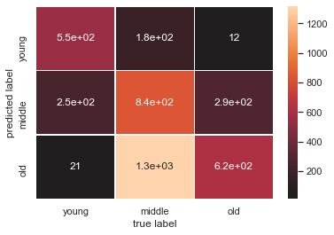
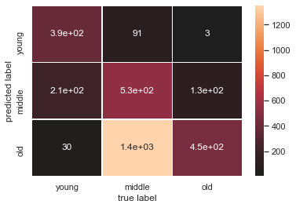
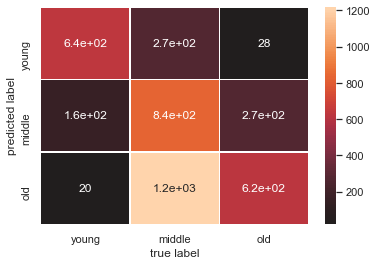
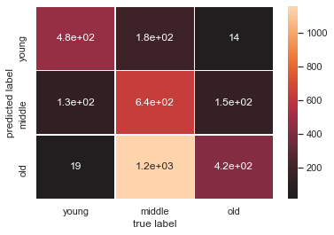

```python
import pandas as pd
import numpy as np
import matplotlib.pyplot as plt
#columns = ['Sex', 'Length', 'Diameter', 'Height', 'Whole weight', 'Shucked weight', 'Viscera weight', 'Shell weight','Rings']
mydata = pd.read_csv('abalone_dataset.csv',sep="\t")
df = mydata.iloc[:, :]
df.columns = ['Sex', 'Length', 'Diameter', 'Height', 'Whole weight', 'Shucked weight', 'Viscera weight', 'Shell weight','Rings']
```


```python
# Import label encoder 
from sklearn import preprocessing
# label_encoder object knows how to understand word labels. 
label_encoder = preprocessing.LabelEncoder()
# Encode labels in column 'Country'. 
df["Sex"]= label_encoder.fit_transform(df["Sex"]) 
df.head()
```


<div>
<style scoped>
    .dataframe tbody tr th:only-of-type {
        vertical-align: middle;
    }

    .dataframe tbody tr th {
        vertical-align: top;
    }

    .dataframe thead th {
        text-align: right;
    }
</style>
<table border="1" class="dataframe">
  <thead>
    <tr style="text-align: right;">
      <th></th>
      <th>Sex</th>
      <th>Length</th>
      <th>Diameter</th>
      <th>Height</th>
      <th>Whole weight</th>
      <th>Shucked weight</th>
      <th>Viscera weight</th>
      <th>Shell weight</th>
      <th>Rings</th>
    </tr>
  </thead>
  <tbody>
    <tr>
      <th>0</th>
      <td>2</td>
      <td>0.455</td>
      <td>0.365</td>
      <td>0.095</td>
      <td>0.5140</td>
      <td>0.2245</td>
      <td>0.1010</td>
      <td>0.150</td>
      <td>3</td>
    </tr>
    <tr>
      <th>1</th>
      <td>2</td>
      <td>0.350</td>
      <td>0.265</td>
      <td>0.090</td>
      <td>0.2255</td>
      <td>0.0995</td>
      <td>0.0485</td>
      <td>0.070</td>
      <td>1</td>
    </tr>
    <tr>
      <th>2</th>
      <td>0</td>
      <td>0.530</td>
      <td>0.420</td>
      <td>0.135</td>
      <td>0.6770</td>
      <td>0.2565</td>
      <td>0.1415</td>
      <td>0.210</td>
      <td>2</td>
    </tr>
    <tr>
      <th>3</th>
      <td>2</td>
      <td>0.440</td>
      <td>0.365</td>
      <td>0.125</td>
      <td>0.5160</td>
      <td>0.2155</td>
      <td>0.1140</td>
      <td>0.155</td>
      <td>2</td>
    </tr>
    <tr>
      <th>4</th>
      <td>1</td>
      <td>0.330</td>
      <td>0.255</td>
      <td>0.080</td>
      <td>0.2050</td>
      <td>0.0895</td>
      <td>0.0395</td>
      <td>0.055</td>
      <td>1</td>
    </tr>
  </tbody>
</table>
</div>


```python
print(df.describe())
```

                   Sex       Length     Diameter       Height  Whole weight  \
    count  4177.000000  4177.000000  4177.000000  4177.000000   4177.000000   
    mean      1.052909     0.523992     0.407881     0.139516      0.828742   
    std       0.822240     0.120093     0.099240     0.041827      0.490389   
    min       0.000000     0.075000     0.055000     0.000000      0.002000   
    25%       0.000000     0.450000     0.350000     0.115000      0.441500   
    50%       1.000000     0.545000     0.425000     0.140000      0.799500   
    75%       2.000000     0.615000     0.480000     0.165000      1.153000   
    max       2.000000     0.815000     0.650000     1.130000      2.825500   
    
           Shucked weight  Viscera weight  Shell weight        Rings  
    count     4177.000000     4177.000000   4177.000000  4177.000000  
    mean         0.359367        0.180594      0.238831     2.028968  
    std          0.221963        0.109614      0.139203     0.655710  
    min          0.001000        0.000500      0.001500     1.000000  
    25%          0.186000        0.093500      0.130000     2.000000  
    50%          0.336000        0.171000      0.234000     2.000000  
    75%          0.502000        0.253000      0.329000     2.000000  
    max          1.488000        0.760000      1.005000     3.000000  
    
import pandas as pd
import numpy as np
corr = df.corr()
corr.style.background_gradient(cmap='coolwarm')

import numpy as np
import seaborn as sns
sns.set()
ax = sns.heatmap(corr, center=0.5, annot=True, linewidths=.5, fmt=".2")

```python
import seaborn as sns
sns.set()
```


```python
def train_validation_data(df,size,features="all"):
    if(features=="all"):
        X = df.drop(["Rings"],axis=1).values
        y = df.Rings
        return X[:size],X[size:],y[:size],y[size:] #X_train, X_test, y_train, y_test
    else:
        X = df.drop(["Rings"],axis=1).values
        y = df.Rings
        return X[:size,:features],X[size:,:features],y[:size],y[size:] #X_train, X_test, y_train, y_test

```


```python
def get_labels(y_pred):
    labels = []
    for val in y_pred:
        if val==1:
            labels.append("young")
        elif val==2:
            labels.append("middle")
        else:
            labels.append("old")
    return labels
```


```python
def PlotConfussion(y_test,y_pred):
    from sklearn.metrics import confusion_matrix, classification_report
    print(classification_report(y_test, y_pred))
    mat_labels = ["young","middle","old"]
    conf = confusion_matrix(y_test, y_pred,)
    sns.set()
    ax = sns.heatmap(conf.T, center=0.5, annot=True, linewidths=.5, xticklabels= mat_labels, yticklabels= mat_labels)
    plt.xlabel('true label')
    plt.ylabel('predicted label')
```


```python
def naive_bayes_report(df,size=100,features="all"):
    X_train, X_test, y_train, y_test = train_validation_data(df,size,features)
    from sklearn.naive_bayes import GaussianNB
    gnb = GaussianNB()
    model = gnb.fit(X_train, y_train)
    model_score = model.score(X_test, y_test)
    y_pred = model.predict(X_test)
    print("Number of mislabeled points out of a total {} points : {}".format(X_test.shape[0], (y_test != y_pred).sum()))
    print("Accuracy score : {}".format(model_score))
    PlotConfussion(y_test,y_pred)
```

### for first 3 features


```python
naive_bayes_report(df,100,3)
```

    Number of mislabeled points out of a total 4077 points : 2066
    Accuracy score : 0.49325484424822175
                  precision    recall  f1-score   support
    
               1       0.74      0.67      0.71       821
               2       0.61      0.36      0.45      2330
               3       0.32      0.67      0.43       926
    
        accuracy                           0.49      4077
       macro avg       0.56      0.57      0.53      4077
    weighted avg       0.57      0.49      0.50      4077
    
    





```python
naive_bayes_report(df,1000,3)
```

    Number of mislabeled points out of a total 3177 points : 1809
    Accuracy score : 0.43059490084985835
                  precision    recall  f1-score   support
    
               1       0.80      0.62      0.70       624
               2       0.61      0.27      0.37      1974
               3       0.25      0.78      0.37       579
    
        accuracy                           0.43      3177
       macro avg       0.55      0.56      0.48      3177
    weighted avg       0.58      0.43      0.44      3177
    
    





### for all features


```python
naive_bayes_report(df,100)
```

    Number of mislabeled points out of a total 4077 points : 1975
    Accuracy score : 0.5155751778268335
                  precision    recall  f1-score   support
    
               1       0.68      0.78      0.73       821
               2       0.66      0.36      0.47      2330
               3       0.34      0.67      0.45       926
    
        accuracy                           0.52      4077
       macro avg       0.56      0.60      0.55      4077
    weighted avg       0.59      0.52      0.51      4077
    
    





```python
naive_bayes_report(df,1000)
```

    Number of mislabeled points out of a total 3177 points : 1640
    Accuracy score : 0.48378973874724585
                  precision    recall  f1-score   support
    
               1       0.71      0.76      0.74       624
               2       0.70      0.33      0.44      1974
               3       0.26      0.72      0.39       579
    
        accuracy                           0.48      3177
       macro avg       0.56      0.60      0.52      3177
    weighted avg       0.62      0.48      0.49      3177
    
    





```python

```
